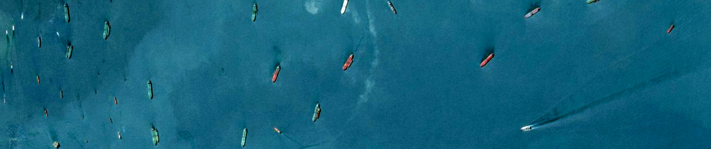
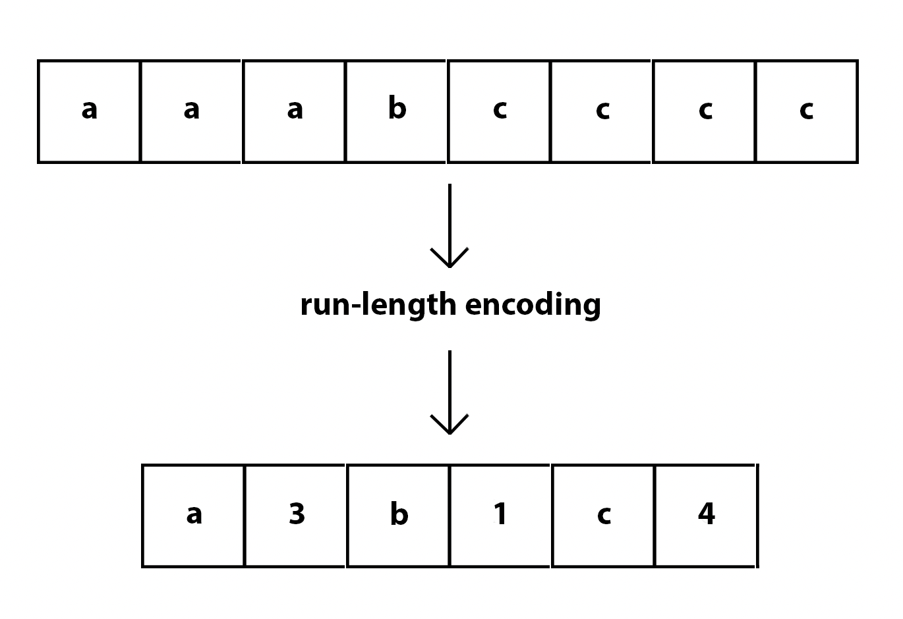
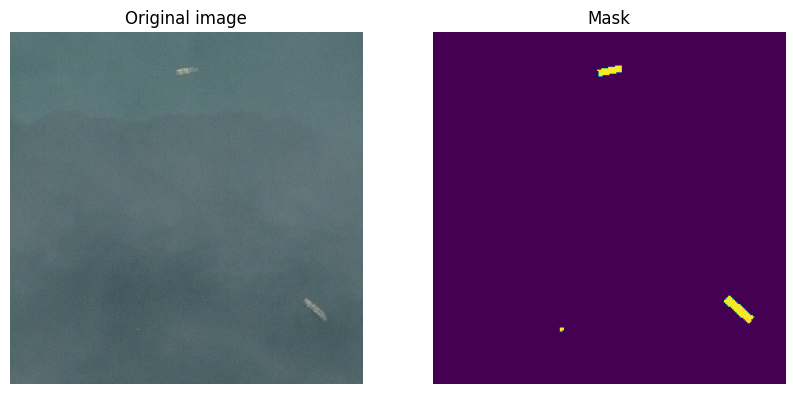
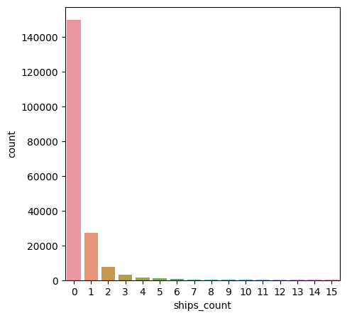
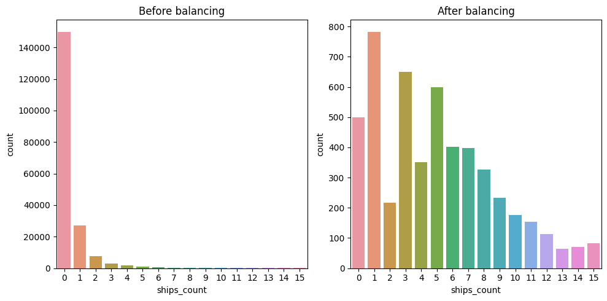
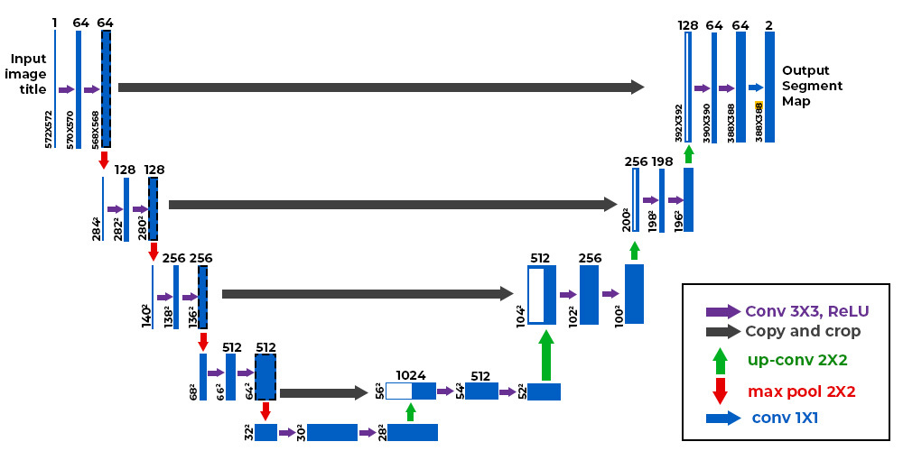
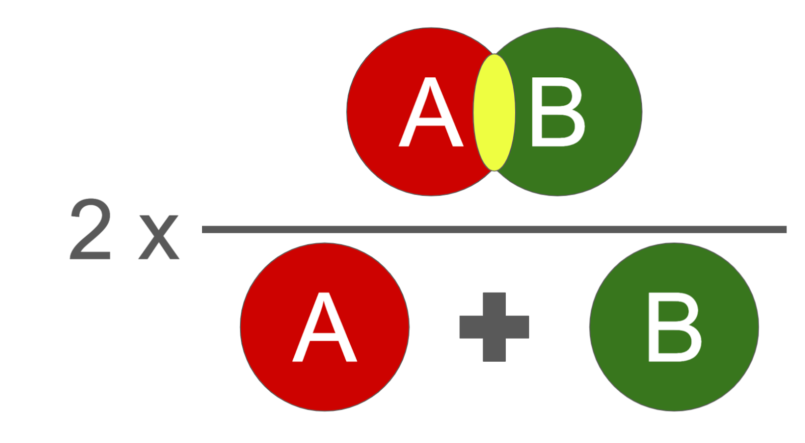
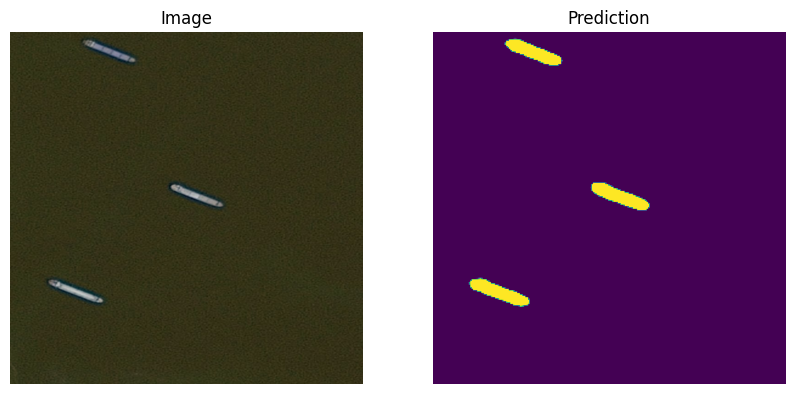
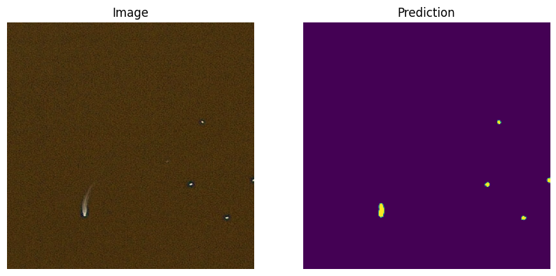
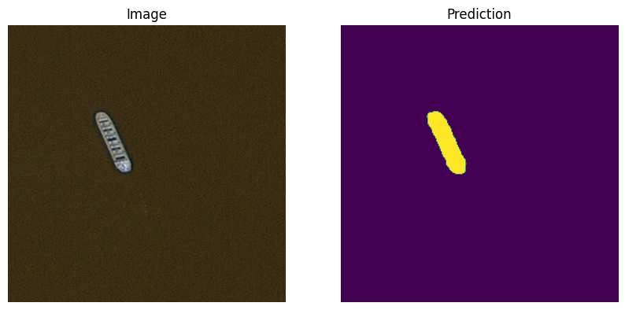

# WINSTARS.AI Test Task

This repository contains solution for Winstars.AI test task based on 
[Airbus Ship Detection Challenge](https://kaggle.com/c/airbus-ship-detection). The neural network behind it is based on 
U-Net architecture, made with Keras API inside tensorflow library. Pretrained model and weights are also provided.



## Repo structure

- In the root directory, `eda.ipynb` was used as the notebook for EDA and initials experiments with datasets, models,
parameters etc. Files `train.py` and `test.py` are derived from the notebook and a bit improved for further 
deployment possibilities. Config contains model and `ImageDataGenerator` parameters, paths to dataset, to model and 
weights, `requirements.txt` has all the libraries needed for the solution to work.
- `utils` directory contains several helper functions, for example creating generators, metrics definitions, model building
and so on.
- `models` directory contains pretrained model and weights for it.
- `dataset` directory is meant for the dataset itself, but for space-saving purpose it has a few images

## Exploratory Data Analysis

On the input we have training and test images as well as a csv file with two columns: `ImageId` and `EncodedPixels` with
image names and pixels which are to indicate as 1 in resulting mask from the image. Selected pixels are represented in 
run-length encoding with each odd number representing pixel and each even number represented as length. There can be 
multiple entries for a single image in the csv, which means that there are multiple ships, but value of `EncodedPixels` 
may also be zero, indicating no ships on the image.



> Run-length encoding overview. [Image source](https://pycad.co/the-difference-between-dice-and-dice-loss/)

To turn rl-encoded pixel values to a shape of image with zeros and ones, we first define function, which decodes a 
single mask and returns a reshaped version of it, and we also need to transpose it. And then we define a function, which 
decodes every mask and performs a logical **OR** operation between them so that the final image contains all the ships.

This is what an image and their decoded masks look like.



As barchart below shows, there is an imbalance in the dataset for ship counts, images without any are the absolute
majority, hence by grouping images by ship groups *(group = ship_counts//2)* and taking random samples of each group, 
intentionally under sampling images without ships two times greater.



The plot below shows the comparison of training dataset before and after balancing ship counts.



## Data preparation

Now, that it became a bit less unbalanced, we can split the remaining dataset into train and validation subsets using 
scikit-learn's `train_test_split` method and merge them with the original training dataframe, created from provided csv.
```python
train_df = pd.merge(train_masks, train_ids)
val_df = pd.merge(train_masks, valid_ids)
```

After this, we define a function for creating generators, which yields a batch of (image, masks) of chosen size with 
each next(), which is convenient to work with in Keras API and `ImageDataGenerators` in particular. We also create
augmented generator, which will help with improving model's accuracy by applying image transformations, params of which
are defined in `config`. We generate a validation generator and take the first batch of it as validation data. 
Due to limitations I have faced while working with kaggle notebook and also time-consuming training I downscaled images
to the size of 256x256 instead of initial 768x768 images.

## Model construction

As it was mentioned earlier, we use **U-Net** architecture, with starting convolutional layers having 16 filters.
We also use **DiceLoss** as a loss function and dice coefficient as an evaluation metric for our model. 
For improving model weights, **Adam** optimizer with `learning_rate=1e-3` is used.
We use some helper functions, like `conv_block`, `encoding_block` and `decoding_block` to build the neural network 
and to make code cleaner inside builder function.
Illustration of this architecture type and metric formulas are shown below.



> U-Net architecture overview. [Image source](https://www.geeksforgeeks.org/u-net-architecture-explained/)



> Dice coefficient formula: intersection over union, with the result times 2. 
> [Image source](https://pycad.co/the-difference-between-dice-and-dice-loss/)

Essentialy, **Dice Loss** is a **1 - dice_coefficient**.

We also add a few callbacks to make our model more flexible and also to save the best model and its weights by 
evaluation metric.
Overall, we add two `ModelCheckpoints`, `ReduceLROnPlateau` to reduce optimizer learning rate if no 
improvements are shown across `patience=5` epochs on evaluation and `EarlyStopping`, to, you guessed it, stopping 
training early if model fails to improve in `patience=20`. 
Every callback from the list is monitoring `val_dice_coef`, which shows more realistic model performance metric, than
the training one.

## Training and testing the model

Finally, we create and compile a model, then create an augmented generator for our training data and pass it to **fit 
method** of the model with it.
After 80 epochs, the training finishes, we get the final best validation metric at **0.49726**.
We can not only see the metrics, but also test acquired model by passing images from the test dataset and looking at 
the resulting masks.

On the illustrations below there are the results of testing the model.



> Prediction 1



> Prediction 2



> Prediction 3